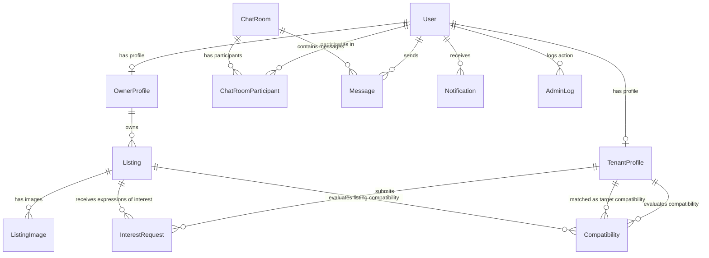

# Database Design & Entity Relationship Documentation

This document explains the schema design, tables, constraints, indexes, and relationships for the **Rent & Flatmate Finder** platform.

## Entity Relationship Diagram

Below is the visual database schema representation using a Mermaid diagram.

---

## Explanation of Relationships

### 1. User ↔ OwnerProfile (1:1 One-to-One)
- **Why**: Every person registered on the platform has a single, unique identity represented by the `User` model. However, owners require specific attributes (like company info, tax details, and verification status) that are irrelevant for tenants. By splitting this into a separate `OwnerProfile` table, we avoid a "bloated" user table, ensure proper normalization, and isolate business logic specific to property management.
- **Cascade Behavior**: `onDelete: Cascade`. If a user account is deleted, their owner profile is cleaned up automatically.

### 2. User ↔ TenantProfile (1:1 One-to-One)
- **Why**: Like owners, tenants require specific behavioral fields (cleanliness, sleep schedule, smoking habits, guest policies, noise preferences) for flatmate matchmaking. Storing this in a dedicated `TenantProfile` ensures clean separation of concerns and allows simple optimization of matchmaking queries.
- **Cascade Behavior**: `onDelete: Cascade`. If a user account is deleted, their tenant profile is also deleted.

### 3. OwnerProfile ↔ Listing (1:N One-to-Many)
- **Why**: A property owner can list multiple properties (apartments, studios, PGs) for rent. However, each listing is owned and managed by exactly one property owner.
- **Cascade Behavior**: `onDelete: Cascade`. If an owner's profile is deleted, all listings posted by them are cascade deleted.

### 4. Listing ↔ ListingImage (1:N One-to-Many)
- **Why**: A single listing can have multiple images to showcase the rooms/amenities. Each image belongs to only one listing. It includes an `order` field to manage display sequence and an `isPrimary` flag to mark the thumbnail.
- **Cascade Behavior**: `onDelete: Cascade`. If a listing is deleted, all related image metadata is cascade deleted.

### 5. TenantProfile ↔ InterestRequest (1:N One-to-Many) & Listing ↔ InterestRequest (1:N One-to-Many)
- **Why**: This forms a many-to-many relationship mapped explicitly using the `InterestRequest` table. A tenant profile can express interest in multiple listings, and a listing can receive interest from multiple tenants.
- **Unique Constraint**: The combination of `tenantProfileId` and `listingId` is unique, ensuring a tenant can only express interest once per listing.
- **Cascade Behavior**: `onDelete: Cascade`. If either the tenant profile or the listing is deleted, the matching interest request is cleaned up.

### 6. ChatRoom ↔ ChatRoomParticipant (1:N) & User ↔ ChatRoomParticipant (1:N)
- **Why**: This forms a many-to-many relationship using the `ChatRoomParticipant` join table. A single chat room can have multiple participants, and a user can participate in multiple chat rooms. Utilizing an explicit join table allows us to store metadata per participant, such as `joinedAt` and `lastReadAt` (essential for calculating unread message counts).
- **Unique Constraint**: The combination of `chatRoomId` and `userId` is unique.
- **Cascade Behavior**: `onDelete: Cascade` on both ends.

### 7. ChatRoom ↔ Message (1:N) & User ↔ Message (1:N)
- **Why**: Messages represent the history within a chat room. A chat room contains many messages. A user acts as the sender of many messages across different chat rooms.
- **Cascade Behavior**: `onDelete: Cascade`. If a chat room or user is deleted, their messages are deleted.

### 8. User ↔ Notification (1:N)
- **Why**: Standard transactional/in-app alert delivery system. A single user can receive many notifications.
- **Cascade Behavior**: `onDelete: Cascade`. Deleting a user deletes their notification queue.

### 9. User ↔ AdminLog (1:N)
- **Why**: For compliance and tracking administrative changes (listing approvals/rejections, user suspensions), an audit log is maintained. Each log is written by one admin user.
- **Cascade Behavior**: `onDelete: Cascade`. If the admin is deleted, the log is deleted.

### 10. TenantProfile ↔ Compatibility & Listing ↔ Compatibility
- **Why**: The compatibility matchmaking engine calculates compatibility percentages.
  - A compatibility score can exist between a tenant profile and another tenant profile (Tenant-to-Tenant matchmaking). This is mapped via `tenantProfileId` (primary evaluator) and `targetTenantId` (secondary evaluator).
  - A compatibility score can also exist between a tenant profile and a listing (Tenant-to-Listing matchmaking), mapped via `tenantProfileId` and `targetListingId`.
- **Cascade Behavior**: `onDelete: Cascade` across all related models to prevent orphaned compatibility records.

---

## Indexes & Optimization Strategy

1. **Query Filtering**: Often-queried columns like `email`, `role`, `isActive`, `status`, `city`, `price`, `propertyType`, and `roomType` are explicitly indexed (`@@index`) to prevent full table scans and speed up search, filtering, and admin searches.
2. **Foreign Keys**: Primary indexes are automatically created for `@id` fields and `@unique` fields. In PostgreSQL, foreign keys are not auto-indexed; hence, explicit `@@index` annotations have been declared on join/foreign key fields (`ownerId`, `userId`, `listingId`, etc.) to optimize JOIN speeds.
3. **Ordering**: Indices on `createdAt` are set where chronological sorting is standard (e.g. listings, messages, notifications, admin logs).
